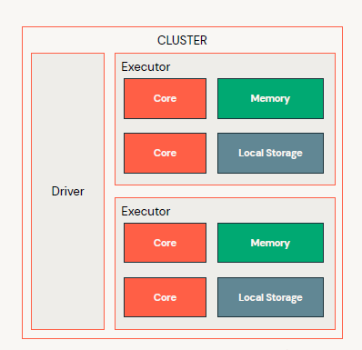
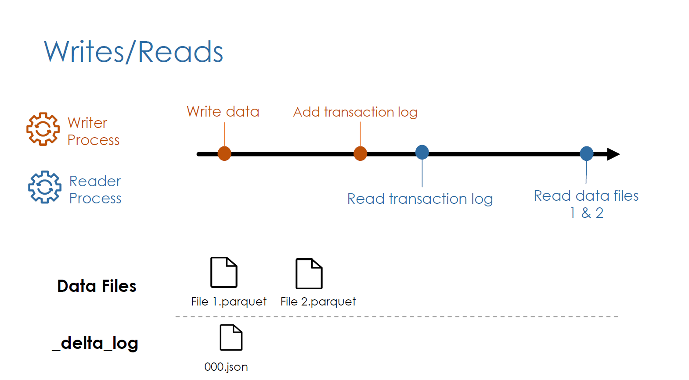
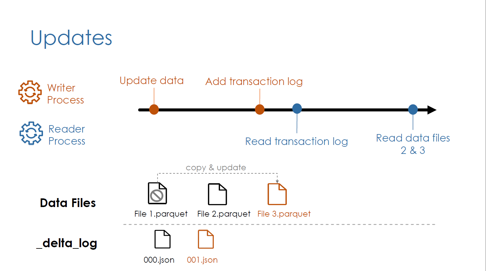
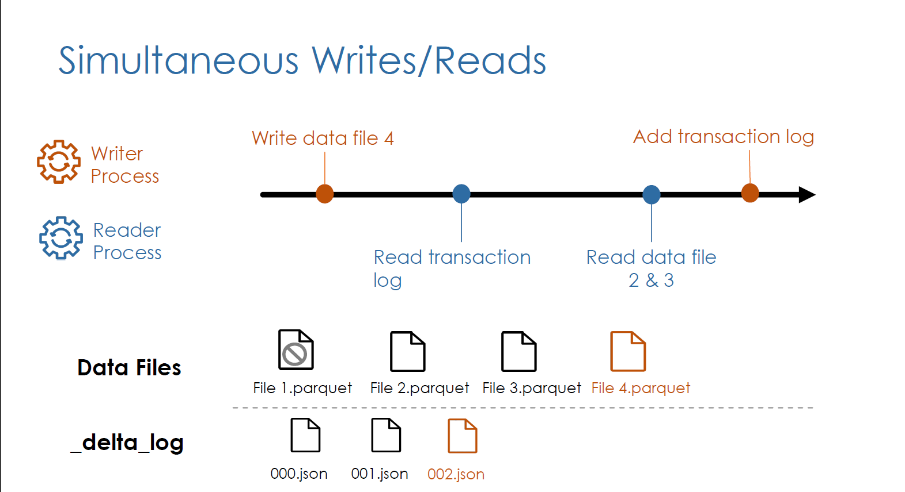
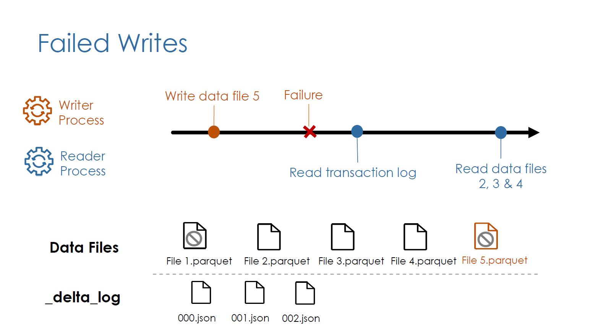

# Databricks Data Engineer Associate

### Databricks Architecture

Following diagram shows the architecture of databricks.

### The control plane 
The control plane is set of backend services that is controlled by databricks inline with the cloud provider that customer chooses (AWS, Azure or GCP). 
1. Workspace configuration 
2. Web application
3. Repo/Notebook
4. Jobs
5. Cluster Management
Are Stored in control plane and encrypted at rest.

### The Data Plane
Data Plane where are the data is stored. It hosts compute aka clusters. connects to backing dbfs and can be connected to external storage such as s3, sql etc. 

1. Cluster:
    1. is a set of computation resources to run notebook or job or instruction.
    2. lives in data plan but managed by control plane. 
    3. have driver node and one or more executer node.
    4. Also have option to create single node cluster for smaller needs.
    5. Workloads are distributed across executors by the driver

    

    Databricks makes a distinction between job and all-purpose cluster

    1.  All Purpose Cluster
        -   Analyse data collaboratively using this.
        -   Can be created using Workspace or API.
        -   Configuration information retained for up to **70 clusters** or **30 Days**

    2.  Job Cluster
        -   Run Automated jobs.
        -   Databricks job scheduler creates job cluster while running job.
        -   Configuration information retained up to 30 most recently terminated clusters. (Can be retained after this but administrator must pin the cluster).
        -   Can not be restarted

2. Databricks Repos
    Notebooks have basic revision control (No centralized history maintained, History can be manipulated or deleted).
    -   Review change history but only basic ops are supported.
    -   Can not merge changes, create branches or tags. 

    Databricks support following git provider
    1.  Azure devops
    2.  bitbucket
    3.  github
    4.  gitlab

    

# Databricks-Data-Engineer-Associate-Notes

### Delta Lake

   #### What is Delta Lake?

   1.  Delta Lake is a optimised *storage layer*.
   2.  Used to *store* files or tables.
   3.  Uses *Open Source* Storage format.
   4.  *Delta Lake* is the *default storage* all operations on Databricks.
   5.  *ACID Compliant* 
   6.  Storage and Compute is decoupled 

   #### How delta lake is different than delta lake?
   Data lake is Non reliable as non-acid compliant 

   #### How Delta Lake works?

    Delta lake Stores data in parquet format and along with data it maintains a Json log file to maintain transaction log since table creation. Json log file maintains
        - Operation Performed and Predicate used such as Conditions
        - Data files affected i.e. newly created or removed

    Each committed transaction is saved in new parquet file. 

    Following is example of transaction:

    Whenever there is any read or write process it will start by reading the transaction log. The transaction log will contain entries of the files that contains the latest data to be readed. 

    

    Whenever there is an update a new transaction log file will be crated and all the data from the parquet file which needs to be updated will be kept in new parquet file and new log file will point the latest data.

    

    The log file will be created only and only if the write operation is succesfull. Which means the latest log file is available will always point to the latest data available. 

    

    If transaction is failed the log file will not get created which means the latest log file will be of last sucesfull transaction which will never point to half inserted or updated data.

    

    [Official Delta Lake Documentation](https://docs.databricks.com/en/delta/index.html)
    [ALL Images Credit take from Udemy course](https://www.udemy.com/course/databricks-certified-data-engineer-associate/)

   #### Types of tables 
       1.  Managed Tables normal SQL syntax
       2.  External Tables needs Location

### Data Objects in Lakehouse
1.  MetaStore -> Stores Metadata 
2.  CatLog-> Group of database
3.  Database/Schema -> Grouping of objects
    -   Table    -  Collection of row and column stored as data file
    -   View     -  Collection of queries to point one or more table or view
    -   Function -  Saved logic which returns scaler value or set of rows

    Tables can be classified as
    1.  Managed Tables.
        Based on files stored in managed storage. 
        metadata is stored in Metastore.
        Deletes table and underlying data when deleted.

    2.  External Table 
        Datafiles are stored in external cloud storage outside managed storage location.
        Only table metadata is managed.
        when dropped only metadata is deleted keeping the data as it is.

### Complex Transformation

1.  Json:
    -   **":"** Syntax can be used to query child or sub items in json. 
    -   **schema_of_json** can be used to retrieve schema of the json.
    -   **from_json** parses a column into json to struct type using json schema.
    -     

2.  Struct types:
    -   **"."** Syntax can be used to query child items in Struct types.
    -   **".*"** can be used to pull subfield of json into own columns.

3. Arrays
    -   **explode** separates items into separate new rows. 
    -   **size** returns count of items in array.
    -   **flattens** combine multiple arrays into one.
    -   **array_distinct** removes duplicate values from array.  
    -	**COLLECT SET** is a kind of aggregate function that combines a column value from all rows into a unique list
    -	**ARRAY_UNION** combines and removes any duplicates
    -	**FLATTEN** Transforms an array of arrays into a single array.
    -	**ARRAY_DISTINCT** The function returns an array of the same type as the input argument where all duplicate values have been removed.
    -	**TRANSFORM** Transforms elements in an array in expr using the function func.

4.  Field
    -   **collect_set** collects unique value for the field.

5. Joins
    -   supports inner, outer, left, right, anti, cross, semi

6. Pivot
    -   Supports pivot using aggregate function for the values described in the column in the list provided.

### User Defined Function (UDFs)

   **SQL UDF**
    
   -   Must have usage and select permission on function 
   -   describe and describe extended can be used
   
   for sql udf example:

        
        CREATE FUNCTION to_hex(x INT COMMENT 'Any number between 0 - 255')
        RETURNS STRING
        COMMENT 'Converts a decimal to a hexadecimal'
        CONTAINS SQL DETERMINISTIC
        RETURN load(hex(least(greatest(0, x), 255)), 2, 0)

    
  **Python UDF**
    
   -   can be registered using spark.udf.register("udf_name",python_function_name)
   -   can also registered using python decorators i.e. @udf("")
   -   pandas udf are available. uses apache arrow. 

## Spark SQL to read data from file or External sources

### CTAS:  CREATE TABLE AS

CTAS is used to query self describing formats such as json, parquet and it can even be used to read data from other sources such as csv, tsv, text, etc. But it will be less usefull as schema can not be provided using CTAS and neither there is any way to use any options.

    

        SELECT * FROM json.`folder\path_to_json.json`

    
json can be replaced with the sources such as csv, parquet, tsv, etc. 

- Do not support Manual Schema Declaration, Schema is infered. 
- Do not support additional file options.
- Creates Actual table and data is moved.

### Create Table statement with using keyword

- Table created using this is non-delta table.
- performance and features like performance, latest data, timetravel is not available
- No data movement actually happens.
- Supports options.
- files are kept in original format.

Example of create table using CSV is as below:

        CREATE TABLE table_name
        (col1,col2,col3....,coln)
        USING CSV
        OPTIONS (header="true", delimiter=";")
        LOCATION path

Example of create table using JDBC:
        
        CREATE TABLE table_name
        (col1,col2,col3....,coln)
        USING JDBC
        OPTIONS (url=jdbc:sqlite://hostname:port,
                dbtable="database.table",
                user="username",
                password="pwd"
                )

        
### Temporary view to point to external data:

Using Temporary view to point external data and it can be loaded into table.

Format for create temporary view and then data load is as shown below:

        CREATE TEMP VIEW temp_view_name (col1,col2,col3....,coln)
        USING data_source
        OPTIONS (key1=val1,key2=val3,....,keyn=valn)

and then the data from temp table can be loaded into delta table using CTAS as shown below:

        CREATE TABLE table_name
        AS select * from temp_view_name

## SQL Queries 

1.  Insert into:

3.  Merge:

4. Overwrite:

        1. Old version of table still exists.
        2. Much faster as it does not need to list or delete files.
        3. Atomic transaction so can be read while overwrite.

    Method 1: Create Or Replace

    Method 2: Insert Overwrite 
        
        

## Anonymous Key Points

1.  What is the difference between Pivot_longer and pivot_wider?
    pivot_wider() is the opposite of pivot_longer() : it makes a dataset wider by increasing the number of columns and decreasing the number of rows. It's relatively rare to need pivot_wider() to make tidy data, but it's often useful for creating summary tables for presentation, or data in a format needed by other tools.

1.  What are magic commands?
    Magic commands in Databricks are special commands that start with a percentage sign (%) and allow you to execute code snippets in different languages or perform various actions within a notebook. For example, you can use magic commands to run SQL queries, switch the notebook context to Python, Scala, or R, display images or mathematical equations, or access the Databricks file system. Magic commands can make your notebook more interactive and versatile, as well as save you time and effort. 

    -   **%run** :  runs a Python file or a notebook.
    -   **%sh** :  executes shell commands on the cluster nodes.
    -   **%fs** :  allows you to interact with the Databricks file system.
    -   **%sql** :  allows you to run SQL queries.
    -   **%scala** :  switches the notebook context to Scala.
    -   **%python** :  switches the notebook context to Python.
    -   **%md** :  allows you to write markdown text.
    -   **%r** :  switches the notebook context to R.
    -   **%lsmagic** :  lists all the available magic commands.
    -   **%jobs** :  lists all the running jobs.
    -   **%config** :  allows you to set configuration options for the notebook.
    -   **%reload** :  reloads the contents of a module.
    -   **%pip** :  allows you to install Python packages.
    -   **%load** :  loads the contents of a file into a cell.
    -   **%matplotlib** :  sets up the matplotlib backend.
    -   **%who** :  lists all the variables in the current scope.
    -   **%env** :  allows you to set environment variables.

    [ref](https://medium.com/@shuklaprashant9264/databricks-magic-command-list-ebe0269934f6)

1. Auto Loader vs Copy Into

    Auto Loader and COPY INTO are two methods of ingesting data into a Delta Lake table from a folder in a data lake. Both features are especially useful for data engineers, as they make it possible to ingest data directly from a data lake folder incrementally, in an idempotent way, without needing a distributed real-time streaming data system like Kafka.

    COPY INTO is a SQL command that loads data from a folder location into a Delta Lake table. It can be used in Databricks SQL, notebooks, and Databricks Jobs.

    Auto Loader incrementally and efficiently processes new data files as they arrive in cloud storage without additional setup.

    - If you’re going to ingest files in the order of thousands, you can use COPY INTO. If you are expecting files in the order of millions or more over time, use Auto Loader.
    - Auto Loader requires fewer total operations to discover files compared to COPY INTO and can split the processing into multiple batches, meaning that Auto Loader is less expensive and more efficient at scale.
    - If your data schema is going to evolve frequently, Auto Loader provides better primitives around schema inference and evolution.

    #### Key points
    1. use auto loader with schema inferance and evolution is frequent.
    2. use copy into when file are less or in thousands.

