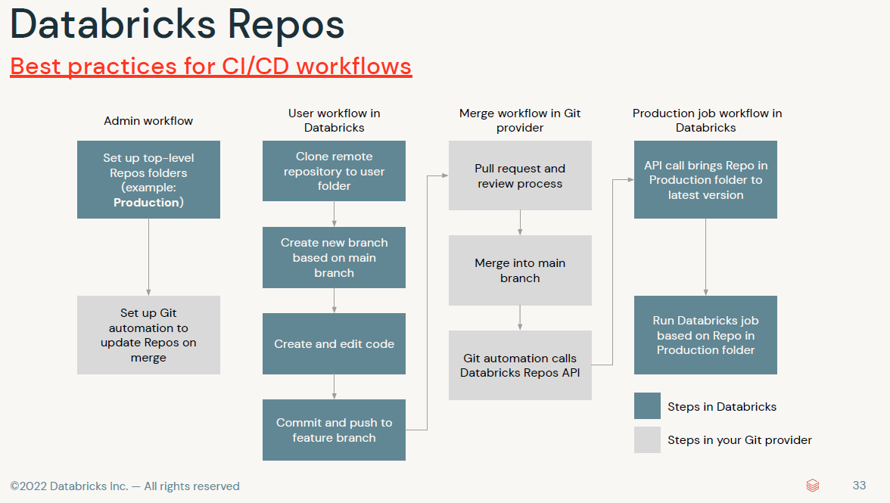

# Databricks Data Engineer Associate

### Databricks Architecture

Following digram shows the architecture of databricks.

### The control plane 
The control plane is set of backend services that is controlled by databricks inlined with the cloud provider that customer chooses (AWS, Azure or GCP). 
1. Workspace configuration 
2. Web application
3. Repo/Notebook
4. Jobs
5. Cluster Management
Are Stored in control plane and encrypted at rest.

### The Data Plane
Data Plane where are the data is stored. It hosts compute aka clusters. connects to backing dbfs and can be connected to external storage such as s3, sql etc. 

1. Cluster:
    1. is a set of computation resources to run notebook or job or instrucations.
    2. lives in data plan but managed by control plane. 
    3. have driver node and one or more executer node.
    4. Also have option to create single node cluster for smaller needs.
    5. Workloads are destributed accross executors by the driver

    

    Datebricks makes a distinction between job and all puprose cluster

    1.  All Purpose Cluster
        -   Analyze data colabarativly using this.
        -   Can be created using Workspace or API.
        -   Configuration information reatiend for upto **70 clusters** or **30 Days**

    2.  Job Cluster
        -   Run Automated jobs.
        -   Databricks job scheduler creates job cluster while running job.
        -   Configuration information retained upto 30 most resently terminted clusters. (Can be retained after this but administrator must pin the cluster).
        -   Can not be restarted

2. Databricks Repos
    Notebooks have basic revision control (No centralized history maintined, History can be manipulated or deleted).
    -   Review change history but only basic ops are suported.
    -   Can not merge changes, create branches or tags. 

    Databricks support following git provider
    1.  Azure devops
    2.  bitbucket
    3.  github
    4.  gitlab

    

Data Objects in Lakehouse
1.  MetaStore -> Stores Metadata 
2.  Catelog-> Group of database
3.  Database/SChema -> Grouping of objects
    -   Table    -  Collection of row and colum stored as data file
    -   View     -  Collection of queries to point one or more table or view
    -   Function -  Saved logic which returns scaler value or set of rows

    Tables can be classified as
    1.  Managed Tables.
        Based on files stored in managed storage. 
        metadata is stored in Metastore.
        Deletes table and underlying data when deleted.

    2.  External Table 
        Datafiles are stored in external cloud storage outside managed storage location.
        Only table metadata is managed.
        when droped only metadata is deleted keeping the data as it is.

### 1. [Delta Lake](DeltaLake\README.md)
### 2. [Reading External Data](ReadingExternalData/README.md)
### 3. [Reading External Data Sources](ReadingExternalData/README.md)
### 4. [Auto Loader vs Copy into](Auto%20Loader%20Vs%20Copy%20Into/Readme.md)

##### End to end data load and fault taularance

##### Identifying the arrival of new files

## Magic Commands

### SQL Endpoints

### Maximum bond vs vm size vs serverless

### check points vs write ahead logging vs idempotent sinks